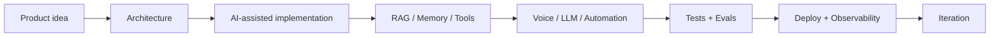

<div align="center">


<br />


<br />
<br />

<h3>
I build AI products with architecture, RAG, voice pipelines, observability, agentic workflows and real validation.
</h3>

<p>
  <strong>AI-assisted by design.</strong>
  My strongest skill is turning ambiguous ideas into structured, testable and deployable systems.
</p>

<a href="https://github.com/skarL007">
  
</a>


</div>

---

## Profile

I am an **AI-native Product Engineer** focused on applied AI systems: **RAG, memory, voice AI, LLMOps, agentic workflows, automation and production validation**.

My workflow is not traditional “hand-code every line from scratch.” I work with modern coding agents and AI-assisted development while owning the parts that matter professionally: **architecture, product direction, decomposition, review, validation, testing, benchmarks, deployment, iteration and technical judgment**.

I am honest about the process because I believe the real skill in modern AI engineering is not pretending the workflow is traditional. The real skill is knowing how to use AI tools responsibly to build systems that can be **tested, explained, improved and operated**.

```text
idea → architecture → agentic implementation → review → validation → deploy → iteration
```

---

## What I build



I focus on systems where AI is not just a chatbot, but part of a product loop: **retrieval, reasoning, memory, voice, automation, cost control, logs and validation**.

---

## Strongest areas

### Product architecture

- Turn ambiguous ideas into structured technical systems.
- Break complex AI products into services, flows and validation gates.
- Design workflows around user experience, latency, cost and reliability.
- Balance deterministic logic, LLM calls, RAG, memory, cache and fallback paths.

### Applied AI engineering

- RAG pipelines with embeddings, metadata and contextual retrieval.
- Voice AI flows with STT, LLM, TTS, streaming and cache strategy.
- LLM routing, prompt contracts, evals, cost tracking and latency benchmarks.
- Observability dashboards for quality, usage, errors, cost and runtime behavior.

### Validation and delivery

- Release gates, tests, smoke checks and benchmark reports.
- Cost, latency and quality comparisons before model decisions.
- Production-like validation instead of relying on “looks good” demos.
- Documentation of risks, trade-offs, rollback paths and known limitations.

---

## Public projects

### [LumenAI SDK](https://github.com/skarL007/-lumen-ai-sdk)

**GenAI FinOps and observability SDK** for tenant-aware cost attribution, OpenTelemetry metadata, Redis/JSONL exporters and typed event contracts.

`Python` `OpenTelemetry` `Redis` `JSONL` `Cost tracking` `SDK design`

**Signals**

- Tenant-level GenAI cost attribution.
- Metadata-first event tracking.
- Redis and JSONL export patterns.
- Local demo without requiring paid model calls.
- Public SDK-style documentation.

---

### [VoiceLaunch TTS](https://github.com/skarL007/sound_voice)

**Local-first desktop launcher for assistive communication.** It turns typed text into speech on the user’s own computer and can route audio to local playback or a virtual microphone for Discord, Zoom, games and calls.

`Electron` `React` `FastAPI` `Python` `Piper` `Kokoro` `TTS` `Accessibility`

**Signals**

- Local-first voice product architecture.
- Assistive communication use case.
- Piper → Kokoro → virtual microphone flow.
- Electron + React + Python/FastAPI runtime.
- Accessibility thinking: quick phrases, history, keyboard flow, compact communicator and large-font/high-contrast UI.

---

### [OpenClaude](https://github.com/skarL007/openclaude)

**Multi-provider coding-agent CLI** focused on terminal-first AI workflows, provider routing, local/cloud model support, tools, agents, MCP-style workflows and developer ergonomics.

`TypeScript` `CLI` `Agents` `Provider routing` `MCP` `Local/cloud AI`

**Signals**

- AI developer tooling.
- Provider abstraction.
- Terminal-first product thinking.
- Multi-model workflow design.
- Technical and non-technical setup documentation.

---

### [CapiNews Data](https://github.com/skarL007/capinews-data)

**Static data and frontend layer** for automated daily AI intelligence reports.

`Automation` `Static frontend` `JSON data` `Reports` `GitHub Pages`

**Signals**

- Lightweight automated publishing.
- Daily generated data structure.
- Historical JSON report organization.
- Public-facing information product workflow.

---

### [AI Software Engineering Notes](https://github.com/skarL007/engenharia-de-software-com-ia-aplicada)

**Learning and reference repository** around AI engineering, prompt engineering, LLMs, RAG, MCPs, browser AI, local models and applied automation.

`AI engineering` `LLMs` `RAG` `MCP` `Automation` `Research notes`

**Signals**

- Continuous learning system.
- AI engineering roadmap tracking.
- Technical synthesis and documentation.
- Research across Web AI, prompt engineering, MCPs, RAG, local models and automation.

---

## Private labs with strong signal

### Projeto-Ents

A production-oriented **RAG + persona + voice AI system** with FastAPI gateway, mobile runtime, memory layers, STT/TTS, LLM routing, anti-repetition logic, observability dashboard, cost tracking and VPS blue/green deployment.

`FastAPI` `RAG` `Voice AI` `Memory` `OpenRouter` `Kokoro` `Redis` `PostgreSQL` `Observability`

**What it proves**

- RAG over character/persona canon.
- Session and user memory strategy.
- LLM model benchmarking by quality, cost and latency.
- Voice pipeline with STT, LLM and TTS streaming.
- Dashboard for runtime quality, input quality, cost and latency.
- Production guardrails, release gate and public smoke validation.
- VPS deployment with health/readiness checks and rollback path.

> Private repository. Public case study can be shared without exposing private source code.

---

### MrRobot

A local-first agents workflow platform for designing, validating and safely running full-stack SaaS generation pipelines.

`Agents` `Workflow UI` `LangGraph` `Kimi` `Node-RED` `HITL` `Dry-run` `Validation`

**What it proves**

- Visual workflow design for agents.
- Human-in-the-loop approval gates.
- Dry-run-first execution model.
- Isolated workspaces for generated artifacts.
- Preview, validation, reports and release handoff.
- Product thinking around safe AI-assisted software generation.

---

### Open-kimi / Omega

A private AI architecture workbench built on top of Kimi Code CLI, combining Python runtime, React workspace, Node-RED orchestration and local bridge workflows.

`Kimi` `React` `Python` `Node-RED` `Multi-agent` `Blueprints` `Local-first`

**What it proves**

- Prompt-to-SaaS blueprint workflows.
- Architecture approval gates.
- Multi-agent orchestration.
- Node-RED integration.
- Dry-run-first execution.
- Local-first AI product operations.

---

### Game_DEV

A game development lab with a top-down survival game and Godot evolution path.

`Python` `Pygame` `Godot` `Game systems` `Procedural audio` `Validation`

**What it proves**

- Game systems thinking.
- Pygame and Godot experimentation.
- Progression, enemies, power-ups, procedural audio and validation tooling.
- Product iteration from prototype to expanded gameplay systems.

---

### Vtuber

A local companion and avatar experiment focused on voice, memory, persona, RAG and interaction loops.

`Companion AI` `Voice` `RAG` `Memory` `Persona` `Avatar`

**What it proves**

- Companion AI exploration.
- Voice/personality runtime ideas.
- Avatar integration experiments.
- Emotional/persona system prototyping.

---

### System / Brain

Private labs for personal knowledge workflows, automation, study systems, AI orchestration and internal tooling.

`Knowledge systems` `Automation` `AI workflows` `Research` `Internal tools`

**What they prove**

- Long-term systems thinking.
- Personal operating system experiments.
- Knowledge organization.
- AI-assisted research and automation workflows.

---

### Auto_Marketing / Leads_Bot / Bot_Discord

Automation labs for marketing, lead workflows and bot interactions.

`Automation` `Bots` `Lead workflows` `Business systems` `Integrations`

**What they prove**

- Business automation experiments.
- Bot workflow design.
- Applied scripting and integration thinking.
- Early-stage product automation patterns.

---

## Technical stack

### Backend


FastAPI, Pydantic, SQLAlchemy, async services, REST APIs, validation, logs and runtime checks.

### Frontend


React, Vite, TypeScript, dashboards, validation UIs and mobile/web test surfaces.

### AI / RAG


LLM APIs, embeddings, RAG, vector search, memory layers, prompt contracts and model benchmarks.

### Voice AI


STT/TTS pipelines, local-first voice flows, streaming audio, cache strategy and assistive communication experiments.

### Ops / Quality


Docker, VPS deploys, health checks, release gates, pytest, smoke tests, dashboards and cost/latency tracking.

---

## How I build AI systems

1. Define the product problem and user outcome.
2. Map architecture, risks, data flow and failure modes.
3. Build fast with AI-assisted implementation.
4. Validate with tests, evals, runtime checks and benchmarks.
5. Measure latency, cost, quality and user experience.
6. Document decisions, limitations and rollback paths.
7. Iterate based on evidence, not just intuition.

---

## What I am improving

I am actively strengthening the parts that turn strong AI-assisted prototypes into maintainable professional systems:

- manual debugging fluency;
- code review discipline;
- smaller and cleaner pull requests;
- long-term maintainability;
- security hardening;
- privacy and data retention policies;
- CI/CD consistency;
- production operations;
- team collaboration.

My current edge is **AI-native product construction**. My next stage is deepening traditional engineering discipline around that edge.

---

## Current focus

```text
RAG + memory systems
Voice AI and TTS/STT pipelines
LLMOps dashboards
AI-assisted software engineering
Agentic workflows with guardrails
Cost-aware AI product design
Production validation and release discipline
```

---

## Profile principle

I do not claim every repository is production-ready.

I do claim a consistent pattern:

> **structure ambitious ideas, build working systems, validate behavior, document trade-offs and improve through evidence.**

---

<div align="center">

<strong>Professional, practical and honest about the process.</strong>

<br />

<sub>
The strongest signal is the ability to structure, build, validate, explain and improve ambitious AI products with modern agentic tools.
</sub>

<br />
<br />

<a href="https://github.com/skarL007">
  
</a>

</div>


