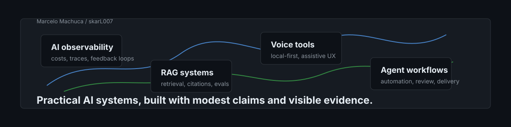

<p align="center">
  
</p>

<h1 align="center">Marcelo Machuca</h1>

<p align="center">
  Applied AI builder working with Python, TypeScript, RAG, voice tools and observability.
</p>

<p align="center">
  <a href="https://github.com/skarL007/-lumen-ai-sdk">LumenAI SDK</a> -
  <a href="https://github.com/skarL007/sound_voice">VoiceLaunch TTS</a> -
  <a href="https://github.com/skarL007/capinews-data">CapiNews Data</a>
</p>

---

## What I am building toward

I am learning by building practical AI systems: tools that can be run, tested, observed and explained. I am not trying to present myself as an expert; I am trying to build a body of work that gets more reliable over time.

My strongest current themes are:

- AI observability and GenAI cost tracking
- RAG systems with citations, receipts and evals
- local-first voice tools and assistive workflows
- coding-agent and automation infrastructure
- careful product hardening with tests, docs and release gates

## Public projects

These are my own public repositories that are worth showing right now.

| Project | Focus | Stack |
|---|---|---|
| [LumenAI SDK](https://github.com/skarL007/-lumen-ai-sdk) | GenAI observability, cost attribution and OpenTelemetry experiments for AI systems. | Python, OpenTelemetry |
| [VoiceLaunch TTS](https://github.com/skarL007/sound_voice) | Local-first assistive TTS app with playback and virtual mic routing. | Electron, React, Python |
| [CapiNews Data](https://github.com/skarL007/capinews-data) | Automated AI report data and static publishing. | HTML, JSON, automation |

## Private case-study areas

Some active work is private while it is being shaped. I mention it as scope, not as public proof.

| Area | What I can discuss |
|---|---|
| Document study tools | Layout-preserving translation, reader workflows, flashcards and source-grounded Q&A for dense PDFs/books. |
| Self-hosted RAG workspaces | Privacy-first research flows, citations, usage metering, follow-up questions and evaluation loops. |
| RAG delivery accelerators | Support assistants with receipts, evals, Docker/CI and client delivery materials. |
| Conversational runtimes | RAG/LLM/TTS gateways, mobile test surfaces, observability dashboards and release gates. |
| Local voice assistants | STT/TTS, memory stores, Windows-first operation and smoke-test validation. |
| Agent tooling | AI-assisted execution, workspace permissions, agent stack analysis and local validation. |
| Authorized audit workflows | Reports, benchmarks, gates, real-time events and optional OpenTelemetry export for approved targets. |

I would rather keep private work described honestly than make the profile look bigger than the evidence available to a visitor.

## Stack

```txt
Languages:   Python, TypeScript, JavaScript
Backend:     FastAPI, Node.js, workers, queues, REST APIs
AI:          RAG, LLM apps, OpenTelemetry for GenAI, voice AI, agent workflows
Data/Infra:  Redis, PostgreSQL, JSONL, Docker, GitHub Actions
Frontend:    React, Electron, Tailwind CSS
Practice:    tests, docs, validation, release gates, observability
```
